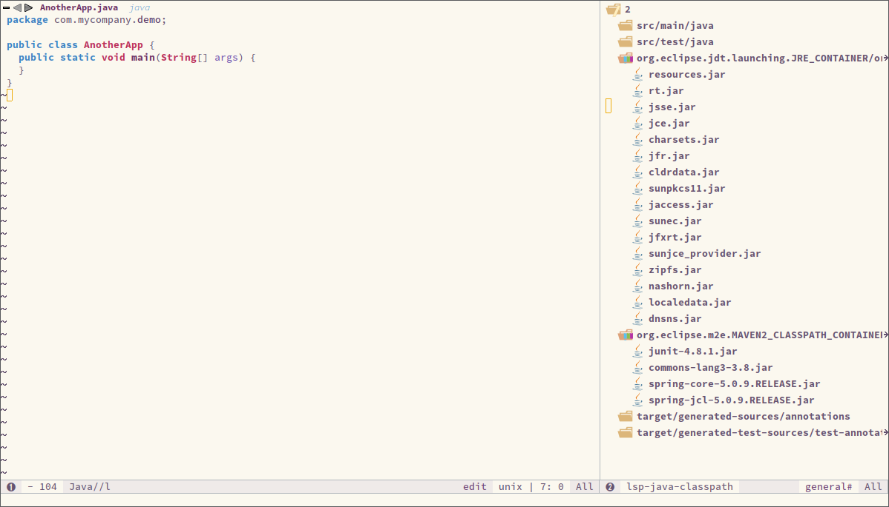

[](https://melpa.org/#/lsp-java)
[](https://travis-ci.com/emacs-lsp/lsp-java)
[](https://gitter.im/emacs-lsp/lsp-mode?utm_source=badge&utm_medium=badge&utm_campaign=pr-badge&utm_content=badge)

Emacs Java IDE using [Eclipse JDT Language Server](https://projects.eclipse.org/projects/eclipse.jdt.ls).
## Features
LSP java mode supports the following JDT Features:
* As you type reporting of parsing and compilation errors (via [flycheck](https://github.com/flycheck/flycheck)/[lsp-ui](https://github.com/emacs-lsp/lsp-ui))
* Code completion - using [company-lsp](https://github.com/tigersoldier/company-lsp) or builtin ```complete-at-point```
* Javadoc hovers - using [lsp-ui](https://github.com/emacs-lsp/lsp-ui)
* Code actions - using [lsp-ui](https://github.com/emacs-lsp/lsp-ui)
* Code outline - using builtin [imenu](https://www.gnu.org/software/emacs/manual/html_node/emacs/Imenu.html)
* Code navigation - using builtin [xref](https://www.gnu.org/software/emacs/manual/html_node/emacs/Xref.html)
* Code lens (references/implementations) - using builtin [xref](https://www.gnu.org/software/emacs/manual/html_node/emacs/Xref.html)
* Highlights
* Code formatting
* Maven pom.xml project support
* Limited Gradle support
* Visual debugger - [dap-mode](https://github.com/yyoncho/dap-mode/)
* Test runner - [dap-mode](https://github.com/yyoncho/dap-mode/)
* Project explorer integration - [treemacs](https://github.com/Alexander-Miller/treemacs)
* Integration with [Spring Initializr](https://start.spring.io/)
## Screenshot

## Installation
### Spacemacs
[lsp-java](https://github.com/emacs-lsp/lsp-java) is included in spacemacs (for now only on the dev branch). If you are using the development version of
spacemacs you can simply add `(java :variables java-backend 'lsp)` to `dotspacemacs-configuration-layers`.

### Install via melpa
The recommended way to install LSP Java is via `package.el` - the built-in package
manager in Emacs. LSP Java is available on the two major `package.el` community
maintained repos - [MELPA Stable](http://stable.melpa.org) and [MELPA](http://melpa.org).

<kbd>M-x</kbd> `package-install` <kbd>[RET]</kbd> `lsp-java` <kbd>[RET]</kbd>

Then add the following lines to your `.emacs` and open a file from the any of the specified projects.
```emacs-lisp
(require 'lsp-java)
(add-hook 'java-mode-hook #'lsp)
```
### [Eclipse JDT Language Server](https://projects.eclipse.org/projects/eclipse.jdt.ls)

[lsp-java](https://github.com/emacs-lsp/lsp-java) will automatically detect when the server is missing and it will download [Eclipse JDT Language Server](https://projects.eclipse.org/projects/eclipse.jdt.ls) before the first startup. The server installation will be in `lsp-java-server-install-dir`. It will detect whether [dap-mode](https://github.com/yyoncho/dap-mode/) is present and it will download the required server side plugins/components. If you want to update the server you can run `lsp-java-update-server`. To run specific version of [Eclipse JDT Language Server](https://projects.eclipse.org/projects/eclipse.jdt.ls) use `lsp-java-server-install-dir`.

### Quick start
Minimal configuration with [company-lsp](https://github.com/tigersoldier/company-lsp) and [lsp-ui](https://github.com/emacs-lsp/lsp-ui) and [dap-mode](https://github.com/yyoncho/dap-mode/). Now you can explore the methods under `lsp-java-*`, `dap-java-*`, `dap-*`, and `lsp-*`
```elisp
(require 'cc-mode)

(condition-case nil
    (require 'use-package)
  (file-error
   (require 'package)
   (add-to-list 'package-archives '("melpa" . "http://melpa.org/packages/"))
   (package-initialize)
   (package-refresh-contents)
   (package-install 'use-package)
   (require 'use-package)))

(use-package projectile :ensure t)
(use-package treemacs :ensure t)
(use-package yasnippet :ensure t)
(use-package lsp-mode :ensure t)
(use-package hydra :ensure t)
(use-package company-lsp :ensure t)
(use-package lsp-ui :ensure t)
(use-package lsp-java :ensure t :after lsp
  :config (add-hook 'java-mode-hook 'lsp))

(use-package dap-mode
  :ensure t :after lsp-mode
  :config
  (dap-mode t)
  (dap-ui-mode t))

(use-package dap-java :after (lsp-java))
(use-package lsp-java-treemacs :after (treemacs))

```
## Supported commands
### LSP Mode commands
* `lsp-execute-code-action` - Execute code action.
* `lsp-rename` - Rename symbol at point
* `lsp-describe-thing-at-point` - Display help for the thing at point.
* `lsp-goto-type-definition` - Go to type definition
* `lsp-goto-implementation` - Go to implementation
* `lsp-restart-workspace` - Restart project
* `lsp-format-buffer` - Format current buffer
* `lsp-symbol-highlight` - Highlight all relevant references to the symbol under point.
* `lsp-workspace-folders-add` - Add workspace folder
* `lsp-workspace-folders-remove` - Remove workspace folder
* `lsp-workspace-folders-switch` - Switch workspace folder
### LSP Java commands
* `lsp-java-organize-imports` - Organize imports
* `lsp-java-build-project` - Perform partial or full build for the projects
* `lsp-java-update-project-configuration` - Update project configuration
* `lsp-java-actionable-notifications` - Resolve actionable notifications
* `lsp-java-update-user-settings` - Update user settings (Check the options in the table bellow.)
* `lsp-java-update-server` - Update server instalation.
#### Refactoring
LSP Java provides rich set of refactorings via [Eclipse JDT Language Server](https://projects.eclipse.org/projects/eclipse.jdt.ls) code actions and
some of them are bound to Emacs commands:
* `lsp-java-extract-to-constant` - Extract constant refactoring
* `lsp-java-add-unimplemented-methods` - Extract constant refactoring
* `lsp-java-create-parameter` - Create parameter refactoring
* `lsp-java-create-field` - Create field refactoring
* `lsp-java-create-local` - Create local refactoring
* `lsp-java-extract-method` - Extract method refactoring
* `lsp-java-add-import` - Add missing import
#### Treemacs
[lsp-java](https://github.com/emacs-lsp/lsp-java) provides experimental integration with [treemacs](https://github.com/Alexander-Miller/treemacs) which provides option to navigate through package dependecies, namespaces, classes and resources.
* `lsp-java-treemacs-register` activates [lsp-java](https://github.com/emacs-lsp/lsp-java)/[treemacs](https://github.com/Alexander-Miller/treemacs) integration.
* `lsp-java-treemacs-unregister` deactivates [lsp-java](https://github.com/emacs-lsp/lsp-java)/[treemacs](https://github.com/Alexander-Miller/treemacs) integration.
* `lsp-java-update-project-uris` refresh the project URIs.
#### Classpath browsing
[lsp-java](https://github.com/emacs-lsp/lsp-java) the command `lsp-java-classpath-browse` which allows users to browse the structure of current projects classpath. From that view the users could go to the particular item.

#### STS4 Integration (experimental)

LSP java has integration with [STS4](https://github.com/spring-projects/sts4/) providing the following functionality.

## Spring boot support (Experimental)

In addition to the integration with [Eclipse JDT Language Server](https://projects.eclipse.org/projects/eclipse.jdt.ls) [lsp-java](http://github.com/emacs-lsp/lsp-java) provides integration with [STS4](https://github.com/spring-projects/sts4/)  which covers Spring Boot
`application.properties`, `application.yml` and `.java` files.

## Usage:
Make sure that you have configured `JAVA_HOME`. `lsp-java` will automatically download the [STS4](https://github.com/spring-projects/sts4/) when you call `lsp-java-update-server`. In order to enable [STS4](https://github.com/spring-projects/sts4/)  integration add the following lines to your config:
``` emacs-lisp
(require 'lsp-java-boot)

;; to enable the lenses
(add-hook 'lsp-mode-hook #'lsp-lens-mode)
(add-hook 'java-mode-hook #'lsp-java-boot-lens-mode)
```

## Functionality for `.java`

### Navigating the source code - Go to symbol in file/workspace
Easy navigation to Spring-specific elements of your source code.


#### Commands
`lsp-workspace-symbol` - (works better usign [helm-lsp](https://github.com/yyoncho/helm-lsp))

#### Examples
* `@/` shows all defined request mappings (mapped path, request method, source location)
* `@+` shows all defined beans (bean name, bean type, source location)
* `@>` shows all functions (prototype implementation)
* `@` shows all Spring annotations in the code

### Quick-access for running apps
Easy navigation to the provided request mappings of running apps.


#### Commands
`lsp-workspace-symbol` - (works better usign [helm-lsp](https://github.com/yyoncho/helm-lsp))

#### Examples
* `//` shows all request mappings of all running Spring Boot apps and opens a browser for the selected endpoint

### Live application information hovers
STS4 automatically detects JVM processes for running boot applications on your local machine.

For some types of information, STS 4 may also show a 'quick summary' as a codelens.

If there are multiple instances of the app running on your machine, the live data from all those instances will show up in the hover information.

``` emacs-lisp
(add-hook 'java-mode-hook #'lsp-java-boot-lens-mode)
```


#### Examples
* `@Profile`: shows information about the active profiles on the running apps
* `@Component`, `@Bean`, `@Autowired`: shows detailed information about the beans and their wiring from the live app
* `@ContidionalOn...`: shows information about the conditions and their evaluation at runtime

### Code templates
Write Spring code with templates, available via regular code completion.

#### Examples
* `@GetMapping`
* `@PostMapping`
* `@PutMapping`

### Smart code completions
Additional code completions for Spring-specific annotations


## Functionality for `.properties` and `.yml`

This extension analyzes your project's classpath and parses and indexes any [Spring Boot
Properties Metadata](https://docs.spring.io/spring-boot/docs/current/reference/html/configuration-metadata.html) it finds. Both Maven and Gradle projects are supported.

The data in the index is used to provide validation, code completions and information
hovers while editing Spring Boot Properties in either `.properties` or `.yml` format.

### Validation and code completion in properties file


### Validation and code completion in yaml file


#### Spring Initializr
`lsp-java` provides a frontend for [Spring Initializr](https://start.spring.io/) which simplifies the creation of Spring Boot projects directly from Emacs via `lsp-java-spring-initializr`.

## Supported settings
* `lsp-java-server-install-dir` - Install directory for eclipsejdtls-server
* `lsp-java-java-path` - Path of the java executable
* `lsp-java-workspace-dir` - LSP java workspace directory
* `lsp-java-workspace-cache-dir` - LSP java workspace cache directory
* `lsp-java-vmargs` - Specifies extra VM arguments used to launch the Java Language Server
* `lsp-java-incomplete-classpath` - Specifies the severity of the message when the classpath is incomplete for a Java file
* `lsp-java-update-build-configuration` - Specifies how modifications on build files update the Java classpath/configuration
* `lsp-java-import-exclusions` - Configure glob patterns for excluding folders
* `lsp-java-favorite-static-members` - Defines a list of static members or types with static members
* `lsp-java-import-order` - Defines the sorting order of import statements
* `lsp-java-trace-server` - Traces the communication between Emacs and the Java language server
* `lsp-java-enable-file-watch` - Defines whether the client will monitor the files for changes
* `lsp-java-format-enabled` - Specifies whether or not formatting is enabled on the language server
* `lsp-java-format-settings-url` - Specifies the file path to the formatter xml url
* `lsp-java-format-settings-profile` - Specifies the formatter profile name
* `lsp-java-format-comments-enabled` - Preference key used to include the comments during the formatting
* `lsp-java-save-action-organize-imports` - Organize imports on save
* `lsp-java-bundles` - List of bundles that will be loaded in the JDT server
* `lsp-java-import-gradle-enabled` - Enable/disable the Gradle importer
* `lsp-java-import-maven-enabled` - Enable/disable the Maven importer
* `lsp-java-auto-build` - Enable/disable the 'auto build'
* `lsp-java-progress-report` - [Experimental] Enable/disable progress reports from background processes on the server
* `lsp-java-completion-guess-arguments` - When set to true, method arguments are guessed when a method is selected from as list of code assist proposals.
## Additional packages
* [lsp-ui](https://github.com/emacs-lsp/lsp-ui) : Flycheck, documentation and code actions support.
* [company-lsp](https://github.com/tigersoldier/company-lsp) : LSP company backend.
* [treemacs](https://github.com/Alexander-Miller/treemacs) : Project viewer.
## FAQ
* LSP Java is showing to many debug messages, how to stop that?
Add the following configuration.
```emacs-lisp
(setq lsp-inhibit-message t)
```
* [lsp-ui](https://github.com/emacs-lsp/lsp-ui) does not display all of the actions on the current point(e. g "Extract constant")?
LSP UI by default sends current line bounds for action region which breaks forces JDT server to return only "Extract method action."
```emacs-lisp
(setq lsp-ui-sideline-update-mode 'point)
```
* LSP Java does not provide completion, go to definition for some of the files?

When particular file is not part of imported project [Eclipse JDT Language Server](https://projects.eclipse.org/projects/eclipse.jdt.ls) could not calculate the current classpath.
